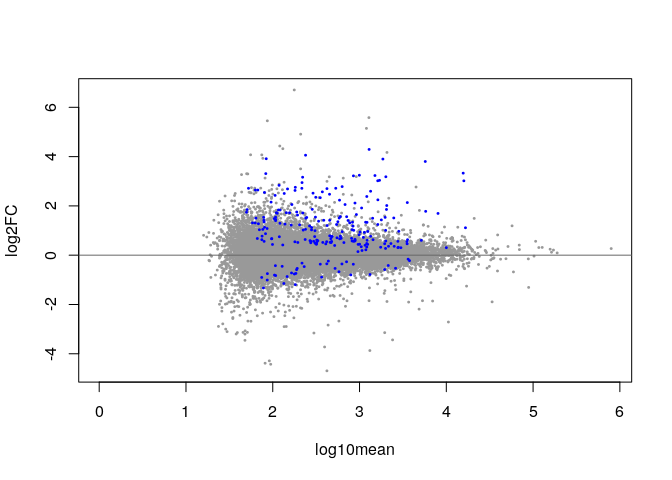
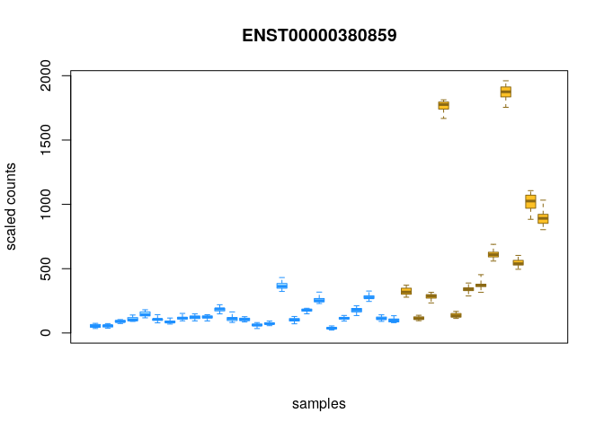

# Main

## Requirements / Inputs
1. A CHPC account and OnDemand login
2. RStudio Server session from ondemand-class.chpc.utah.edu.
   1. [Reminder] Classes menu and MIB2020. 2 cores and 3 hours.
3. (optional) RStudio installed on desktop/laptop
4. `tidyverse`, `tximeta`, `fishpond` packages (and dependencies) installed in R. For install in RStudio Server OnDemand:
```r
install.packages('rlang', lib = .libPaths()[1], version = '0.4.11', INSTALL_opts = "--no-lock")

install.packages('Rcpp', lib = .libPaths()[1])

BiocManager::install( c('DESeq2', 'fishpond', 'tximeta', 'tidyverse', 'clusterProfiler', 'DOSE'), lib = .libPaths()[1], ask = FALSE )
```
5. Metadata table for full Biopsy Sample RNAseq. You can do this from "Terminal" tab in RStudio.
```bash
mkdir -p ~/BioinfWorkshop2021/Part3_R_RNAseq/metadata/
cp /uufs/chpc.utah.edu/common/home/round-group2/BioinfWorkshop2021/Part3_R_RNAseq/metadata/SraRunTable_RNAseq_BiopsyOnly.txt \
 ~/BioinfWorkshop2021/Part3_R_RNAseq/metadata/
```

## Objectives
##### I. Review and finish intro to R and Data Frames.
##### II. Introduce data wrangling with tidyverse packages.
##### III. Create metadata table with alignment paths using tidyverse functions.
##### IV. Import alignment data and begin differential expression analyses.

## Start RStudio Server Interactive App on OnDemand
- If not already done.

## Load Project
**Load Project from last class**:
- In the upper right hand corner of RStudio underneath power button, or with `File -> Open Project..`, browse to and open the project file that should be named the same as the Folder "Part3_RStudioIntro.Rproj".
  - *NOTE*: You may not have saved your project and/or workspace because we skipped around a bit last time, dealing with some install issues. This is okay, just create a new project if you somehow didn't save it (RStudio saves these when you close the project, but if you just closed the server tab it would not have saved your current state).

**OR**

**Create a new project** as we did last time:
- If you just didn't save the Rproject but did create it during class, your directory should already be there as should an R project file. If you missed class, you won't have the directory, so choose to either create new project in existing directory or new project in new directory as appropriate.
- Create a project in a directory called "Part3_RStudioIntro". `File -> New Project..`

## Read in metadata table as "tibble"
- We will read in the same table from last time we were reading in. You already did this and should have it as an R object if you loaded your saved R project from last class.
    - Do it again, to ensure we have the same input table in the same format for this class. Especially since I changed around the name of the object last time to deal with the lack of the `readr` package for many.

```r
library(tidyverse)
```

- Use the "readr" function with the button to read in the file (Environment pane -> "Import dataset" -> "From text (readr)"). Remember, this file is not in the same R project directory we are in, but should be in `~/BioinfWorkshop2021/Part3_R_RNAseq/metadata`.

While reading in, change a few things:
1. Change "Delimiter" (at the bottom) to "Tab".
2. Make sure "First Row As Names" box is checked.
3. For column "Age", click the arrow drop down and change it to "Integer"
4. In bottom left "Name" field, change the name of the object to import into to: "metadata".
5. Check (or leave checked) the "Open Data Viewer" box so it opens for viewing after we import it.

- Note that this is actually a good place to normally import columns/variables you are going to test (for example here the column "asthma_status") as factors by using the dropdown for a column and changing to "factor", then listing the "levels" of this factor (i.e. factor names). However, I want to show you how to do this later so we will not do this for now.

The readr function should look like this (you **don't** need to enter this, but in practice you should copy it to your markdown so you can document it)(one command over multiple lines shown here. Follow the parentheses):
```r
metadata <- read_delim(
    "~/BioinfWorkshop2021/Part3_R_RNAseq/metadata/SraRunTable_RNAseq_BiopsyOnly.txt",
    "\t", escape_double = FALSE, col_types = cols( Age = col_integer() ),
    trim_ws = TRUE)
```

- Notice that since we used the `readr` function from the tidyverse, it actually imports this as a "tibble", a specialized version of a data frame that can generally be used as any other data frame.
  - See the "Type" in the "Environment" tab is listed as "spec_tbl_df"
  - Or, get the structure in R:
  ```r
  str(metadata)
  ```


## Accessing data frames (quick review)
- Again, some of the funtions you encountered in Linux are available in R
- Use `head` and `tail` functions to access the table.
```r
head(metadata)
tail(metadata)
```

- Tidyverse makes the tibble a little easier to view. Or at least tries to.
- You can use `names()` or `colnames()` to get the column/variable names and `row.names()` to get rows.
```r
names(metadata)
colnames(metadata)
row.names(metadata)
```

- The fact that 'names' function does the same as colnames hints at common structure of tables in R. Really expecting names of variables to be in columns, not rows. You can certainly import data in the other way and work with it, but R definitely has more of a default expectation as "columns = variables".

- The base R `summary` function is helpful as well to display more info about a table and even show distribution of data.
```r
summary(metadata)
```

- This is handy, but there are much more useful summarization function in the tidyverse. We will return to these after review.

- Remember the transpose function `t()` and how to set a new variable with the `<-`:

```r
metadata.t <- t(metadata)
str(metadata.t)
```

- It is not even a tibble anymore, and the structure doesn't make a ton of sense. Remove it with `rm()`.
```r
rm(metadata.t)
```

## Accessing data frames: Variable accession
- Here, we use the same symbol `$` to access the variables/columns as we did in Linux.
  - It's just that the variables are inside an object, so we first refer to the object.
  - Get the variable age from the table:
```r
metadata$Age
str(metadata$Age)
```
- Want to access a specific element in that 1D *vector*? As before, add the square brackets:
```r
metadata$Age[4]
```

- However, data frames are 2 dimensional at their highest level, so can themselves be described with the same square brackets but with [row,column] notation.
- Let's create a new table removing the extraneous "BioSample" column. We'll pass a list of column numbers, but we could do the same with the quoted names.

### Create vectors and lists with c()
Because we skipped in class the install part that introduced vector construction in R, we will cover it here again briefly using the list of columns as examples and remove the "BioSample" column.
- Vectors are 1 dimensional objects with 1 or more entries. Similar to what you would naturally think of as a "list", but lists in R and other programming languages are a separate, slightly different type of data type.
  - Analogous to how data frames aren't tables (a "matrix" in R) because they can hold multiple different data types, lists aren't vectors and each list item can contain a different data type, while vectors must all contain the same data type.
- We generally use the `c()` function in R to create these vectors.
- Create a list of the column numbers to keep. There are at least 2 ways to accomplish the same task here:
```r
cols2keep <- c(1,2,3,5,6,7,8,9,10)
cols2keep <- c(1:3,5:10)
cols2keep
```
- Notice how we can use the `:` character to specify a range.
- Vectors can contain other types of information (such as character strings), but can hold only 1 type of data. In other words I could also create a list of named columns, but can't mix and match with integers for column numbers in a single vector.
- We could similarly create a vector of character strings with the c() function.
  - Notice the "Type" in the Environment pane of the "cols2keep" vector, then notice how it changes when we reassigned it with names.
```r
cols2keep <- c("Run", "Age", "asthma_status", "LibraryName", "obesity_status", "sex", "smoking_status", "tissue", "replicate")
```


## Accessing data frames: by coordinates
Now let's use our list of columns to keep to remove the 4th column.
- Data frames can be described with the same square brackets notation used for vectors, but with [row, column] notation because they are 2D.
- Show the first 7 rows (`1:5`) and the Biosample (4th column) and the LibraryName (5th column) to see that this group deposited biological replicates as a different Biosample. The "SIBXXX" is the patient identifier. Therefore, the BioSample IDs are unique as well as the Run IDs and we can remove the BioSample column for our purposes:
```r
metadata[1:7 , c(4, 5)]
metadata[1:7 , c("BioSample", "LibraryName")]
```

- Pass the vector of columns to keep and the original metadata object.
```r
metadata <- metadata[ , cols2keep]
```
- Notice how we could directly overwrite the metadata table in the same function.
  - Very common in R. Think about if you went back and redid this command?
      - This would NOT behave as expected if we used column numbers because the number to variable has changed when we removed the BioSample column number 4.

- **Important Reminder**: Be careful of repeating commands on overwritten data! When in doubt, save multiple version of your objects / rename them as you go.

## Basic data wrangling with the tidyverse

There is much more we can do with data frames in base R functions, but the tidyverse has a number of similar functions that are MUCH more powerful. The tidyverse is so commonly used with data in R, it now seems safe to just use it instead and not spend too much time with the base R functions. Just be aware that I have only given a very very small intro to the base R functions.

Here, we will go through quite a lot of functions in one class. Don't worry that you won't remember all this from one class and if it feels a bit overwhelming. I think it is very important to show you what you can do with data in R and to get some of these functions in your head, but would not expect you to remember them all in one class. This example was carefully created to:
1. Gain more experience in R and the tidyverse specifically
2. Put these functions in your head.
3. Show you what can be accomplished.

In the future, you can and will find the functions you need Again, but it's hard to have an idea where to even start if you don't have a general idea of what can actually be accomplished.

### The pipe operator
The "pipe" operator is introduced as part of one of the packages in tidyverse and acts very similarly to the pipe you saw in Linux (the `|`). However, it uses the 3-character combination symbol: **`%>%`**.
- `%>%`: Pipe symbol in tidyverse. "pipes" output from one function or object to the next.

As a quick example, and to show that you can open and pipe an object (i.e. not just a function's output) read the metadata table and get the column names in 2 different ways
```r
metadata %>% names()
names(metadata)
```
- Notice how you didn't have to specify the metadata to the names function in the first command. This is behaving as we saw for commands in Linux, where without a specified input, the function takes what was piped to it. In Linux this was called the standard input and it is behaving similarly here.

- The most useful thing about the pipe (in my opinion) is that it makes R code much more readable. You can see it is accomplishing the same thing as just nesting functions, but instead of functions within functions within functions, each gets separated by the pipe character making it much more easy for the human eye to parse in a linear manner.

### Better summarization with `dplyr`
- Now we've seen the pipe, let's put it in action to see how we can better summarize data structure in the tidyverse:

- The `dplyr` package (part of the tidyverse) has more useful functions for summarization. It does less by itself, but with the group_by function can give some useful summarization of variables. Let's count the number of each type of replicate found in the dataset.
  - The summarize function can take other functions as input. See it's help file for more info and examples (mean, min, max, sd, etc are available). Here, run it without another function, then using the `n` function to count.

```r
metadata %>% group_by(replicate) %>% summarize()
metadata %>% group_by(replicate) %>% summarize( n = n() )
```

- Notice how these 2 functions that are part of the tidyverse have as their first option the ".data" option listed. As with most functions, but explicit in tidyverse functions, this shows that they will take an input piped to them and it is assumed to go in this first option listing.

- We can frequently just pass multiple variable to many of tidyverse functions (without quotes). So we can group by multiple factors:
  - Also, notice how we are actually setting a column/variable name for the output of the `n()` function. We can change this to call it "number" here:

```r
metadata %>% group_by(replicate, asthma_status) %>% summarize( number = n() )
```

- **Important**: I want to be clear that this (passing multiple unquoted variables outside a vector) is not *normal* R behavior. It saves a lot of typing and easier reading, but this is *tidyverse behavior* and most of the time things listed like this in a function will refer to options of that function as we have previously seen. Or, if you are passing a list of columns they will likely need to be quoted and within a character vector (`c()`).

- We have uneven biological replicates in this dataset, where some have replicates and some do not. Let's get just a single alignment set for  each sample.
  - 2 potentially interesting outside-of-class problems here. You could include only those with replicates and work this data into your analysis (this is common and doable with tools we use in this class), OR just test for differences among replicates.

### Subsetting data with filter and select

The `filter()` and `select()` functions in tidyverse are used to subset based on rows and columns/variables respectively. Let's make 2 datasets to potentially examine with differential expression analysis later.
1. Samples with replicates only (Input table to create: `metadata_repsOnly`):
2. All individuals but only 1 replicate: (Input table to create: `metadata_singleSamp`)

#### Evaluating expressions

A number of functions built in can be used to evaluate the conditions of your filter. Here are some of the most commonly used:
- `==`: Equality. Important to understand this is different than a single `=`. Usually, you would want to use the double `==` to evaluate if a string IS in the searched space.
- `>`, `>=`, etc.: Self-explanatory
- `!=`: IS **NOT**. The `!` is common across languages as a symbol for "not"
- `&`: And
- `|`: OR
- `is.na()`: Evaluates if the value is missing "NA". Returns a boolean (TRUE/FALSE)

#### `filter()`

Using the full metadata table, let's first remove a few samples from this full dataset which are listed as replicates, but didn't have the other replicate deposited in the SRA.
```r
filter(metadata, Run != "SRR10571716" & Run != "SRR10571713" & Run != "SRR10571682")
```
- Good, we went from 62 to 59 rows.

- Again, notice how the values to look for are in quotes, but the column/variable name does not have to be in quotes when using tidyverse functions.
  - Be aware of this because many accessors of columns in other packages (and base R) will expect them in quotes. Did I say this already? It's important.

- We didn't assign this to a new object yet, because we aren't done filtering. We are building up a single filter function. It's a good idea to do this with your commands to make sure they are working as expected first. Just like we did with chained Linux commands.

- Now, add another filter to remove those that never had a replicate to begin with ("NA" in the "replicate" column) and create our new table. First, use the is.na() function by itself to see how it behaves:

```r
is.na(metadata$replicate)
```
Notice how this function returns true or false values for each position, asking if it is NA. Since filtering works on determining TRUE criteria, and we won't those that are not NA (i.e. FALSE), we want the opposite of this result. Now, add this into your function to do the table filtering and assign it to a new object.:

```r
metadata_repsOnly <- filter(metadata,
 Run != "SRR10571716" & Run != "SRR10571713" & Run != "SRR10571682" &
 is.na(replicate) == FALSE)
```
- Can you think of another way to do this with the `!` symbol?

#### `select()`
Selects works pretty naturally as you might expect, and in the term hints to SQL terminology usage. We could use the same data table accession coordinates we showed earlier, but select has as very common type of syntax derived from SQL that is great for working with tables and is similar to how QIIME2 filters out data. As an initial simple example, let's just get rid of the extra columns "replicate" and "tissue" which are the same for all samples now. We'll use the `-` in front of the variable to remove, which is commonly used in R notation to remove something, but in this case we could have also used the `!`.
- Why do I mention SQL and why spend so much time on the tidyverse? This kind of big table manipulation and data extraction usually required this specialized coding knowledge (SQL). The tidyverse makes these tasks more reasonable and, I believe, much more understandable and doable by those of us that aren't coders.
- Can't I do this in excel? Not efficiently, not on big tables you'll get in HT-seq projects, and not reproducibly with good documentation.

```r
metadata_repsOnly <- select(metadata_repsOnly, -replicate & -tissue)
```
Pretty straightforward as you might expect. Usually you will be passing simpler criteria to select than to filter().

#### Combine commands to filter and subset in one step
Now, to reinforce the commands we just covered let's create the second table (`metadata_singleSamp`) in one step along with pipes. For this group of samples we want to:
1. Use only samples with a single sample or replicate 1
2. Remove the tissue and replicate columns

```r
metadata_singleSamp <- metadata %>%
  filter(replicate == "biological replicate 1" | is.na(replicate)) %>%
  select(-replicate & -tissue)
```

### Adding new variables with mutate()
The `mutate()` function "mutates" the input tibble data frame to add a new variable/column you specify. At first glance that may seem simple and something you can do with base R functions (which of course you can). However, mutate is applying a function row-by-row so is often a simpler way to add new variables that were calculated from one or more existing variables.

- For our RNAseq analysis, we will first have to know where the alignment files are for each sample to read in to R.
  - It's a good opportunity to illustrate the mutate command and a couple other useful base R commands.

- Let's create a new object that lists *ALL* the alignment file locations, using the original metadata object. I'll list the path to the shared directory I created that has them all, but you can change it to your directory if you created them as well.

First, create an object with the path to the directory with the alignments (make sure there's **not** a trailing `/` at the end):
```r
ShareDir <- "/uufs/chpc.utah.edu/common/home/round-group2/BioinfWorkshop2021/Part3_R_RNAseq/BiopsyOnly"
```

1. Create a new tibble dataframe with the Run ID as the first (and only at this point) column. We name the column as we create it. This is handy and common behavior in tidyverse functions, but not outside of it and you'd normally need to rename in another command.
```r
align_paths <- tibble(Run = metadata$Run)
```
2. Use mutate to add the shared directory filepath as a new variable. Also, add the filename "quant.sf" which is in each sample's directory as a variable.
```r
align_paths <- mutate(align_paths, shared_dir = ShareDir, quant_file = "quant.sf")
```
- Check out the "align_paths" object to see your work. Open it by clicking on the table icon in "Environment" tab or type its name to show it.
- Notice how mutate naturally adds entries for the number of rows. Seems obvious, but with base R you'd need to specify how many and replicate them and they must align. Mutate is remarkably flexible and helpful for doing something iteratively across rows.

3. Use mutate to add the Run/Sample-specific folder name.
- Salmon output results into a folder for each RNAseq sample (or Run as it's called in our metadata table). So, we have a folder that is named something like: `SRRXXXXXX_salm_quant` for each result (where XXXXXX is the SRA accession number).

The `paste()` function is frequently useful to join strings together to create a longer string. This is a base R function. Here, we will use it twice to first create the folder name for each sample, then use it again to join it with the ShareDir path where all these folders are.

  - `paste()`: Joins/pastes character strings together with a specified delimiter

```r
align_paths <- mutate(align_paths, samp_dir = paste(align_paths$Run, "salm_quant", sep = "_"))
```
Notice how we specified the delimiter/separator to use which puts the underscore `_` in between the items pasted together.

4. Now, use paste again to join the 3 columns with the directory separator forward-slash as the delimiter, to create a full file path for each sample's quant.sf file, and retain only the 2 columns we need.
```r
align_paths <- mutate(align_paths, fullpath =
  paste(align_paths$shared_dir, align_paths$samp_dir,
    align_paths$quant_file, sep = "/")) %>% select(Run, fullpath)
```

5. Quickly view the values in that "fullpath" column now:
```r
align_paths$fullpath
```
- You could copy one of those and paste it with `ls -l` in your Terminal to see that the path is correct and refers to an actual file.

### Joining tables in the tidyverse
Joining tables is a common task which comes with all sorts of potentially confusing terminology that comes from SQL syntax as well. There are all kinds of 'joins': "inner_join", "outer_join", "left_join", etc. We will keep it simple and show one type here, but I encourage you to look into this further as well for more complicated tasks.
  - The base R function these generally replace is "merge", which is actually pretty simple, but using the "join" family of functions opens a lot of tunable options.

We have a separate object in R that has all our file paths of all the samples, but we have 2 different subsets of samples (the "metadata_repsOnly" and the "metadata_singleSamp").
  - We want to add just the file paths of our subsets from the tibble with all the samples to each subset table. Because both our tables have "Run" in the first column, this function will join them naturally as you would expect by "Run".
      - It's worth noting that this isn't a requirement (the joining factor in the first column) and you can specify different columns to join on and how to behave with extra/missing rows in one table. See the help file for any of the "join" functions in tidyverse.

- In order to drop rows that are not present in the smaller 'metadata_repsOnly' and 'metadata_singleSamp' we will use a "left_join". Note how you could accomplish this with a different type of join while adding appropriate options.
  - A "left join" means you want to join things to the first listed input (as they are listed left to right).

```r
metadata_repsOnly <- left_join(metadata_repsOnly, align_paths)
metadata_singleSamp <- left_join(metadata_singleSamp, align_paths)
```

Pretty straightforward commands. This isn't a great example of how powerful these joining methods are however (it's very simple), but rather what they are intended to accomplish. I very much encourage you to look at their help files and/or further into join functions (for example, in the very good "Modern Dive" tutorial that is linked to in the links section.)

## Save and export objects

- We can export specific objects in R. This is different from saving your whole workspace including all the objects.
  - This is not usually a good idea because this disconnects them from the project, but certainly you should know how to do it so I provide an example.
      - `saveRDS()`: Saves an external (external to R) file of an object, while `save()` saves the full workspace.
  - Let's save our new table as objects so we can reimport them to a separate workspace:
```r
saveRDS(metadata_repsOnly, file = "metadata_repsOnly.rds")
saveRDS(metadata_singleSamp, file = "metadata_singleSamp.rds")
```

- Keep in mind that, as written, these files will be saved to your current working directory. You could have specified a different directory in that filename (the whole path is the actual file name!). So, these files should be in "~/BioinfWorkshop2021/Part3_RStudioIntro".
  - Check that they are there with the list.files() command:
  ```r
  list.files()
  ```

- Reminder that RStudio saves the project when you close it, as well as prompting for a workspace location to save. It will also prompt to save any markdown or other text files you have open but have not yet saved. Thus, just closing projects is the recommended way to save, but at the least you need to make sure you save your workspace.
    - You can change if RStudio asks to save workspace or not in the global options, or if it just saves it by default. I suggest you leave it to "ask" or just save it to .RData by default, but don't change to "never".
- Let's close this project and save your workspace for your reference.
  - We are now done with "Part3_RStudioIntro" and will move on to the actual RNAseq analysis in "Part3_R_RNAseq"

## Begin Part3-4 RNA seq analysis

- We will try to dive right into RNAseq analysis in this session depending on the time. Previously, this class ended here.

- Reminder of our generalized project workflow:


**Objective**

Examine differential transcript and gene abundances between smoking and asthma status using the “swish” (SAMseq With Inferential Replicates Helps) functions in the “fishpond” package.
  - In the interest of time, we will actually just focus on the single sample per individual dataset (`metadata_singleSamp`).
  - The other dataset can be accessed with our `metadata_repsOnly` object, and I leave it as an outside of class excercise for you to assess.

**Fishpond, tximeta, swish package specifics**

There are 3 major points worth noting here that are either not always done or are more recent applications in RNAseq analysis.
1. Differential Transcript Expression (DTE) analysis (`fishpond`):
   It is not uncommon to start by mapping to genes and perform DE analysis. This is inadvisable because differential transcript usage within the same gene can occur and the transcript difference info is lost at the beginning. It is better to summarize to genes later.
2. Inferential replicates (`swish` function in `fishpond`):
   These methods use bootstrapping or resampling (in our case Gibb’s resampling) to model technical replicates with single samples. This is a newer method now implemented in a few different RNAseq analysis packages (eg. Kalisto, swish) that addresses some of the known biases in RNAseq experiments and supposedly allow more accurate quantification of transcripts.
3. Linked references and provenance tracking (`tximeta`):
   As we saw with QIIME2, one of the major goals of contemporary bioinformatic packages is to link all the input data and functions performed on a data set which allows much better documentation by tracking the provenance, or where a result came from, of objects/results. For RNAseq it is critical we know and report at a minimum the **exact** transcriptome from which an analysis is performed.


### Start new Project for our RNAseq analysis
- Our previous project for intro to R was in "Part3_RStudioIntro" directory. We kept it in a separate folder to maintain our project-centric organization and to show you could create a new project in a new directory.
- Now, make a new project in an existing directory: "**Part3_R_RNAseq**". This is where we started our RNAseq project with read alignments and you may have been able to get the alignment outputs here. Don't worry if you don't have read alignments here yet, I'll have you copy over mine to follow along.

1. Start a new project. `File -> New Project.. -> Existing Directory` and choose the Part3_R_RNAseq directory you should already have.
2. Open a new markdown document. `File -> New File -> R Markdown ...`
   - Give it the name "Biopsy_RNAseq_Analysis" (or whatever you like really) and put your name in it, but otherwise leave defaults.
   - R may ask to install some packages if this is the first markdown you've created. Allow it to do so.
   - Remove all the example text except the first code chunk with knitr setup. (i.e. everything after and including the "## R Markdown")
   - Add your working commands as you go, or just run them within each code chunk and test them all within your markdown.
     - **Your goal** is that, in the end, you will be able to run the entire markdown which will run all your code again and create outputs and graphs.
3. Load required packages:
```r
library(tidyverse)
library(tximeta)
library(fishpond)
```
- tximeta does take a minute or so to load.
- You can use the SuppressPackageStartupMessages() function and put the library commands within it, to avoid printing. You could get a *similar* behavior in your RMarkdown by puttting `message = FALSE` in the code chunk at the beginning. I.e. `{r, message = FALSE}`.
4. Read in our previously created and formatted metadata files, which we exported from R and saved as objects:
```r
metadata_singleSamp <- readRDS(file = "~/BioinfWorkshop2021/Part3_RStudioIntro/metadata_singleSamp.rds")
```
- **OR, If you did not save this to your home directory previously**, I have a copy of it in the shared space you can read from instead.
```r
metadata_singleSamp <- readRDS(file = "/uufs/chpc.utah.edu/common/home/round-group2/BioinfWorkshop2021/Part3_R_RNAseq/metadata_singleSamp.rds")
```
- Remember, this method of importing another object is not an ideal method because it doesn't document here what we did to create those objects from the original table. Typically, it would be better to save and rerun the code you used to create them instead.

### Step 0. Link transcriptome indexes

- The `tximeta` package is a nice newer package that reads in our mapped files to a SummarizedExperiment object by taking in information in a GTF file about the features (transcripts) themselves such as genomic location, length, name, etc.
- The `SummarizedExperiment` and `GenomicRanges` packages used by tximeta are very frequently used for these tasks in Bioconductor/R analysis of HTSeq data. This is always the first step after mapping/aligning, but this method also links them to the reference transcriptome from which they came, IF we linked the data to the reference we created (as we did here) or used their precomputed transcriptome. As this was human, we had a good precomputed transcriptome which has all the information already.
- Below, I show for example how you could link the rest of the data for a given transcriptome if you created it from scratch (non-model organisms or new strain genomes for example).
  - This is shown as an example/reference only and **should not be run for the class**. Just notice how it links the reference index created, the fasta file it came from and the genomic information (GTF file) all together.
  - See the `tximeta` github page for more information.

``` r
indexDir <- "/uufs/chpc.utah.edu/common/home/round-group1/reference_seq_dbs/salmon_indices/Hs.GRCh38.cdna.all_salmon_0.11/"
fastaFTP <- "ftp://ftp.ensembl.org/pub/release-100/fasta/homo_sapiens/cdna/Homo_sapiens.GRCh38.cdna.all.fa.gz"
gtfFTP <- "ftp://ftp.ensembl.org/pub/release-100/gtf/homo_sapiens/Homo_sapiens.GRCh38.100.gtf.gz"
makeLinkedTxome(indexDir = indexDir, source = "Ensembl", organism = "Homo sapiens", release = "100", genome = "GRCh38", fasta = fastaFTP, gtf = gtfFTP)
```

### Step 1. Format the metadata for `tximeta` and `fishpond`

First, we need to rename the column names as expected by tximeta (using tidyverse “rename” function). It’s a little unusual you can’t just specify the column names but, for now at least, tximeta looks for specific column names for the name of the sample and the filepath.

``` r
metadata_singleSamp <- rename(metadata_singleSamp, files = fullpath, names = Run)
```

Additionally, usually we will need factors within variables to be explicitly stored as such within our object for downstream statistical testing. Remember, we could have done this when we imported the table, but I wanted to show you the code as well since it is more generalizable outside of the tidyverse. Let’s just do this for our factors of interest for simplicity, but other variables would need to be changed as well if you want to test them. However, before we do this we need to remove the “Ex-smoker” samples because swish currently can only deal with 2 factor levels.

``` r
metadata_singleSamp <- filter(metadata_singleSamp, smoking_status != "Ex-smoker")
```

Now, change our two variables of interest to factors.

``` r
str(metadata_singleSamp)
```

    ## tibble [37 × 8] (S3: tbl_df/tbl/data.frame)
    ##  $ names         : chr [1:37] "SRR10571666" "SRR10571669" "SRR10571671" "SRR10571672" ...
    ##  $ Age           : int [1:37] 41 52 41 53 57 29 52 54 47 52 ...
    ##  $ asthma_status : chr [1:37] "Asthma" "Non-asthma" "Asthma" "Asthma" ...
    ##  $ LibraryName   : chr [1:37] "Biopsy_SIB049" "Biopsy_SIB047" "Biopsy_SIB046_rep1" "Biopsy_SIB006_rep1" ...
    ##  $ obesity_status: chr [1:37] "Obese" "Non-obese" "Obese" "Obese" ...
    ##  $ sex           : chr [1:37] "female" "female" "male" "female" ...
    ##  $ smoking_status: chr [1:37] "No" "Yes" "No" "No" ...
    ##  $ files         : chr [1:37] "/uufs/chpc.utah.edu/common/home/round-group2/BioinfWorkshop2020/Part3_R_RNAseq/BiopsyOnly/SRR10571666_salm_quant/quant.sf" "/uufs/chpc.utah.edu/common/home/round-group2/BioinfWorkshop2020/Part3_R_RNAseq/BiopsyOnly/SRR10571669_salm_quant/quant.sf" "/uufs/chpc.utah.edu/common/home/round-group2/BioinfWorkshop2020/Part3_R_RNAseq/BiopsyOnly/SRR10571671_salm_quant/quant.sf" "/uufs/chpc.utah.edu/common/home/round-group2/BioinfWorkshop2020/Part3_R_RNAseq/BiopsyOnly/SRR10571672_salm_quant/quant.sf" ...

``` r
metadata_singleSamp <- metadata_singleSamp %>% mutate(asthma_status = as.factor(asthma_status), smoking_status = as.factor(smoking_status))
head(str(metadata_singleSamp))
```

    ## tibble [37 × 8] (S3: tbl_df/tbl/data.frame)
    ##  $ names         : chr [1:37] "SRR10571666" "SRR10571669" "SRR10571671" "SRR10571672" ...
    ##  $ Age           : int [1:37] 41 52 41 53 57 29 52 54 47 52 ...
    ##  $ asthma_status : Factor w/ 2 levels "Asthma","Non-asthma": 1 2 1 1 1 1 1 1 1 1 ...
    ##  $ LibraryName   : chr [1:37] "Biopsy_SIB049" "Biopsy_SIB047" "Biopsy_SIB046_rep1" "Biopsy_SIB006_rep1" ...
    ##  $ obesity_status: chr [1:37] "Obese" "Non-obese" "Obese" "Obese" ...
    ##  $ sex           : chr [1:37] "female" "female" "male" "female" ...
    ##  $ smoking_status: Factor w/ 2 levels "No","Yes": 1 2 1 1 2 1 2 1 1 1 ...
    ##  $ files         : chr [1:37] "/uufs/chpc.utah.edu/common/home/round-group2/BioinfWorkshop2020/Part3_R_RNAseq/BiopsyOnly/SRR10571666_salm_quant/quant.sf" "/uufs/chpc.utah.edu/common/home/round-group2/BioinfWorkshop2020/Part3_R_RNAseq/BiopsyOnly/SRR10571669_salm_quant/quant.sf" "/uufs/chpc.utah.edu/common/home/round-group2/BioinfWorkshop2020/Part3_R_RNAseq/BiopsyOnly/SRR10571671_salm_quant/quant.sf" "/uufs/chpc.utah.edu/common/home/round-group2/BioinfWorkshop2020/Part3_R_RNAseq/BiopsyOnly/SRR10571672_salm_quant/quant.sf" ...

    ## NULL

``` r
summary(metadata_singleSamp)
```

    ##     names                Age           asthma_status LibraryName       
    ##  Length:37          Min.   :21.00   Asthma    :19    Length:37         
    ##  Class :character   1st Qu.:32.00   Non-asthma:18    Class :character  
    ##  Mode  :character   Median :41.00                    Mode  :character  
    ##                     Mean   :42.22                                      
    ##                     3rd Qu.:53.00                                      
    ##                     Max.   :60.00                                      
    ##  obesity_status         sex            smoking_status    files          
    ##  Length:37          Length:37          No :25         Length:37         
    ##  Class :character   Class :character   Yes:12         Class :character  
    ##  Mode  :character   Mode  :character                  Mode  :character  
    ##                                                                         
    ##                                                                         
    ##

Certainly you can do these two steps in the opposite order without
error, but what happens to the levels? If you set the levels first, then
remove the “Ex-smoker”, while the rows will be removed, the information
on those levels will remain associated with the tibble. A small, but
important point.

### Step 2. Import mapping/alignment counts

As I noted above, `tximeta` depends on the commonly used
SummarizedExperiment package, and it will export a common “SE” or
summarized experiment object which contains counts per feature as well
as metadata you provide. `tximeta` additionally adds metadata for the
transcriptome reference as well. It is made to work with Salmon by
default but results from other methods can be imported as well, and by
default transcript-level info is assumed, but again can be used with
gene-level info. We’ll call the imported object simply `sS_se` for
“single sample summarized experiment”. Because our metadata file has the
paths to the alignment/counts files we just need to provide this table.

``` r
sS_se <- tximeta(metadata_singleSamp)
```

    ## importing quantifications

    ## reading in files with read_tsv

    ## 1 2 3 4 5 6 7 8 9 10 11 12 13 14 15 16 17 18 19 20 21 22 23 24 25 26 27 28 29 30 31 32 33 34 35 36 37

    ## Warning: `select_()` is deprecated as of dplyr 0.7.0.
    ## Please use `select()` instead.
    ## This warning is displayed once every 8 hours.
    ## Call `lifecycle::last_warnings()` to see where this warning was generated.

    ## Warning: `filter_()` is deprecated as of dplyr 0.7.0.
    ## Please use `filter()` instead.
    ## See vignette('programming') for more help
    ## This warning is displayed once every 8 hours.
    ## Call `lifecycle::last_warnings()` to see where this warning was generated.

    ## found matching linked transcriptome:
    ## [ Ensembl - Homo sapiens - release 100 ]
    ## loading existing EnsDb created: 2020-06-10 16:49:58
    ## loading existing transcript ranges created: 2020-06-10 16:51:46

    ## Warning in checkAssays2Txps(assays, txps):
    ##
    ## Warning: the annotation is missing some transcripts that were quantified.
    ## 8176 out of 178517 txps were missing from GTF/GFF but were in the indexed FASTA.
    ## (This occurs sometimes with Ensembl txps on haplotype chromosomes.)
    ## In order to build a ranged SummarizedExperiment, these txps were removed.
    ## To keep these txps, and to skip adding ranges, use skipMeta=TRUE
    ##
    ## Example missing txps: [ENST00000631435, ENST00000632524, ENST00000633009, ...]

It’s worth noticing the warning of differences between annotations and
transcripts that were quantified. We quantified/mapped/aligned &gt;178k
transcripts! Of course it is a much greater number than the number of
genes in the human genome, but why are &gt;8k of these transcripts
missing a listing from the GTF file? The warning gives the answer
generally as well, and since human genomes will have a very high amount
of known haplotypic differences this is as expected. In fact, if we look
at the slit of transcripts missing they are almost all TCR and BCR/Ig
sequences. It’s worth noting this and thinking carefully about your
input reference. This could be a potential downside to transcript-level
quantification if the features of the transcripts are not at the same
resolution as the reference transcripts.

### Step 4. Prepare summarized experiment for DE

``` r
suppressPackageStartupMessages(library(fishpond))
```

First, we run a couple functions to prepare the summarized experiment
object. We will scale the inferential replicates so they are properly
compared and then do a default filtering of transcripts for which we
have few counts among few samples. The latter is an important
consideration which should always be performed at some level in order to
reduce the amount of noise in your data and reduce multiple hypothesis
testing correction effect due to features/transcripts which we don’t
have enough counts to do reasonable tests in the first place. Think of a
transcript that shows up in only one of your samples as an extreme
situation which would be filtered here. Nicely, the function does not
actually “filter” them out, but simply masks them from the subsequent
tests.

``` r
sS_se <- scaleInfReps(sS_se)
sS_se <- labelKeep(sS_se, minCount = 100, minN = 5)
```

#### (aside) S4 objects in R and the SummarizedExperiment Object

It is important to understand a little bit about how this big object is
storing data because it is not just a very big data frame or table. S4
class objects and functions in R are very common amongst bioinformatics
packages. What are these? You can probably imagine it would be very
difficult (impossible?) to maintain all the information about a
gene/transcript/feature, sample, experiment/assay, sample metadata,
gene/feature metadata and experimental model in a single 2D table or
data frame. Thus, different classes of data storage have been devised
which allow nesting of data in a standardized manner and allow you to
store multiple data types together. I think of them as tables within
tables, though this is an oversimplification. The S4 class is one of
these which is frequently used in bioconductor packages. The `sS_se`
summarized experiment object is an S4 class object. First, use the `str`
function to view the structure of this object.

``` r
str(sS_se)
```

Woa! A lot of information is stored in this object! That makes sense
given that we have counts for each transcript in each sample, linked
transcriptome and metadata in here, among others. Scroll through the
printed structure to get a sense of it, but head to the first part of
the output. Notice how it says the “… with 6 slots”. These “slots” each
have a type of data and can have slots nested within them as well as you
can see in this hierarchical structure. These slots can be accessed with
the `@` if you want to access them directly, just like you accessed
variables/columns in a data frame with the `$`. Use `slotNames` to view
the top-level slots:

``` r
slotNames(sS_se)
```

    ## [1] "rowRanges"       "colData"         "assays"          "NAMES"          
    ## [5] "elementMetadata" "metadata"

Generally though, you won’t access these slots or data in an S4 object
like this because you need to know a bit about how each specific S4
class object is constructed in order to make sense of them. Instead,
these S4 class objects usually have associated functions specific to the
object type in order to access the data within them, so-called
“accessor” function. One such accessor for SummarizedExperiments is the
`colData()` function to show the experimental metadata. Let’s look at it
to see if our experimental metadata was read in correctly.

``` r
library(SummarizedExperiment)
```

``` r
colData(sS_se)
```

    ## DataFrame with 37 rows and 7 columns
    ##                   names       Age asthma_status        LibraryName
    ##             <character> <integer>      <factor>        <character>
    ## SRR10571666 SRR10571666        41        Asthma      Biopsy_SIB049
    ## SRR10571669 SRR10571669        52    Non-asthma      Biopsy_SIB047
    ## SRR10571671 SRR10571671        41        Asthma Biopsy_SIB046_rep1
    ## SRR10571672 SRR10571672        53        Asthma Biopsy_SIB006_rep1
    ## SRR10571674 SRR10571674        57        Asthma Biopsy_SIB045_rep1
    ## ...                 ...       ...           ...                ...
    ## SRR10571748 SRR10571748        26        Asthma      Biopsy_SIB012
    ## SRR10571751 SRR10571751        58    Non-asthma Biopsy_SIB010_rep1
    ## SRR10571760 SRR10571760        34        Asthma      Biopsy_SIB002
    ## SRR10571749 SRR10571749        32    Non-asthma      Biopsy_SIB011
    ## SRR10571717 SRR10571717        41    Non-asthma      Biopsy_SIB018
    ##             obesity_status         sex smoking_status
    ##                <character> <character>       <factor>
    ## SRR10571666          Obese      female             No
    ## SRR10571669      Non-obese      female            Yes
    ## SRR10571671          Obese        male             No
    ## SRR10571672          Obese      female             No
    ## SRR10571674          Obese      female            Yes
    ## ...                    ...         ...            ...
    ## SRR10571748          Obese      female             No
    ## SRR10571751          Obese      female             No
    ## SRR10571760      Non-obese        male             No
    ## SRR10571749          Obese      female            Yes
    ## SRR10571717          Obese        male            Yes

Notice how the “asthma\_status” and “smoking\_status” are listed as
factors as we specified them, but the others are not. Another useful
accessor is `rowRanges()` for the genomic ranges info of all the
features. `mcols()` function is a generic S4 accessor function (i.e. not
specific to SummarizedExperiment) which we can use to get info for each
gene. Use this to see how some of the first listed transcripts (TCRs and
Ig) which have 0 or very low mean counts are set to keep = FALSE by the
`labelKeep()` function earlier.

``` r
mcols(sS_se)
```

    ## DataFrame with 170341 rows and 8 columns
    ##                           tx_id             tx_biotype tx_cds_seq_start
    ##                     <character>            <character>        <integer>
    ## ENST00000415118 ENST00000415118              TR_D_gene         22438547
    ## ENST00000434970 ENST00000434970              TR_D_gene         22439007
    ## ENST00000448914 ENST00000448914              TR_D_gene         22449113
    ## ENST00000604642 ENST00000604642              IG_D_gene         20003840
    ## ENST00000603326 ENST00000603326              IG_D_gene         20004797
    ## ...                         ...                    ...              ...
    ## ENST00000612259 ENST00000612259 unprocessed_pseudogene               NA
    ## ENST00000506922 ENST00000506922 unprocessed_pseudogene               NA
    ## ENST00000420212 ENST00000420212 unprocessed_pseudogene               NA
    ## ENST00000538284 ENST00000538284 unprocessed_pseudogene               NA
    ## ENST00000411576 ENST00000411576 unprocessed_pseudogene               NA
    ##                 tx_cds_seq_end         gene_id         tx_name
    ##                      <integer>     <character>     <character>
    ## ENST00000415118       22438554 ENSG00000223997 ENST00000415118
    ## ENST00000434970       22439015 ENSG00000237235 ENST00000434970
    ## ENST00000448914       22449125 ENSG00000228985 ENST00000448914
    ## ENST00000604642       20003862 ENSG00000270961 ENST00000604642
    ## ENST00000603326       20004815 ENSG00000271317 ENST00000603326
    ## ...                        ...             ...             ...
    ## ENST00000612259             NA ENSG00000278589 ENST00000612259
    ## ENST00000506922             NA ENSG00000250114 ENST00000506922
    ## ENST00000420212             NA ENSG00000231258 ENST00000420212
    ## ENST00000538284             NA ENSG00000256626 ENST00000538284
    ## ENST00000411576             NA ENSG00000236504 ENST00000411576
    ##                            log10mean      keep
    ##                            <numeric> <logical>
    ## ENST00000415118                    0     FALSE
    ## ENST00000434970                    0     FALSE
    ## ENST00000448914 6.51217099699069e-05     FALSE
    ## ENST00000604642                    0     FALSE
    ## ENST00000603326                    0     FALSE
    ## ...                              ...       ...
    ## ENST00000612259                    0     FALSE
    ## ENST00000506922                    0     FALSE
    ## ENST00000420212   0.0172819268991122     FALSE
    ## ENST00000538284                    0     FALSE
    ## ENST00000411576    0.534121869151834     FALSE

Check out SummarizedExperiments’s bioconductor page (listed below in
links) for more information, but this very short intro should suffice to
understand that these objects are different than just a big table or
data frame and require different methods to access the data within them.

### Step 5: DTE analysis with swish

Now we get to the heart of differential expression analysis with the
swish function. The function itself is fairly straightforward when only
testing for one effect, but has options for covariates and pairing of
samples which I hoped to get into as well, but this “intro” was getting
too long. An important point though is that this method performs a
number of permutations with random sampling. Whenever any function does
these type of permutational analyses they will not be totally
reproducible if you don’t set the random seed to the same number, so we
do this first (the number is somewhat arbitrary, but setting 1 is always
safest and allows you to be consistent). We are going to reduce the
number of permutations to 10 just to run this a bit faster in class, and
we will test for effect of smoking.

``` r
set.seed(1)
sS_se <- swish(sS_se, x = "smoking_status", nperms = 10)
```

Now, briefly, use the `mcols()` function again to see how the p-values,
q-values and fold changes were added as a column to the transcripts.

``` r
mcols(sS_se)
```

`mcols()` is returning a data frame of an S4 class (not a tibble data
frame like we used earlier) so we can’t yet use our tidyverse functions
on it directly, but we could change it to a tibble data-frame and use
tidyverse functions. Importantly however, this dissociates it from the
specific hypothesis test we made so leaves no context for those pvalues.
Thus, if you do this, make sure it is named as such. Let’s just use some
of the functions we already have used to count to see how many values
have q &lt; 0.05.

``` r
mcols(sS_se) %>% as_tibble() %>% filter(qvalue < 0.05) %>% nrow()
```

    ## [1] 231

### Step 6 (optional): DGE analysis with swish

We can still perform gene-level differential expression (DGE) analysis
because transcripts can be grouped by the genes they come from. The
reverse is not necessarily true (i.e. if we did gene level
counting/alignments we couldn’t necessarily back out to
transcript-level). The testing of differences is basically the same, but
we first need to regroup them to genes. `tximeta` provides a function
for this, and because we linked all the reference information to the
index, all the information required to do this is already together.

``` r
sS_se_gene <- summarizeToGene(sS_se)
```

    ## loading existing EnsDb created: 2020-06-10 16:49:58

    ## obtaining transcript-to-gene mapping from TxDb

    ## loading existing gene ranges created: 2020-06-14 22:59:17

    ## summarizing abundance

    ## summarizing counts

    ## summarizing length

    ## summarizing inferential replicates

Notice the object is still a summarized experiment object, but is \~
4.5X smaller. Clearly we have lost a LOT of information by doing
gene-level analysis. That is not to say this is inappropriate or not
what we are looking for. As before, we scale filter/mask genes with low
counts. If we started with gene level grouping we would need to do
`scaleInfReps()` as well first, but since these reps are at the level of
transcript and we already scaled them we don’t need to do it again.

``` r
sS_se_gene <- labelKeep(sS_se_gene, minCount = 100, minN = 5)
```

Let’s run swish again to test for differences at the gene-level. Because
this is much smaller we can run a lot more permutations quickly than we
did with the transcript-level data set.

``` r
set.seed(1)
sS_se_gene <- swish(sS_se_gene, x = "smoking_status", nperms = 50)
```

Then, let’s just retrieve the number of genes with a q &lt; 0.05 as
before.

``` r
mcols(sS_se_gene) %>% as_tibble() %>% filter(qvalue < 0.05) %>% nrow()
```

    ## [1] 180

It’s interesting to compare this gene-level number with the
transcript-level result. Proportionally, there are \~5X as many genes
differential abundant than there are transcripts (there’s \~31k genes
and 170k transcripts). Why? Love and Patro lab’s papers provide some
great discussion on this and why transcript-level expression makes more
sense usually. There certainly some biologically reasonbale reasons for
this, but there’s also different amounts of variation between the 2
datasets and so different filtering/masking of low abundance features
should really be applied. This is dataset-specific and I think should be
considered more carefully for your experiments. Regardless, we do have
some differences between smokers and non-smokers.

### Step 7 (optional): Examine differential transcript isoform usage

We actually can’t do this with the package version we have. In order to
install the newer versions of fishpond that contain a function for this
we would need to upgrade our R installation as well, which we cannot do
with OnDemand through CHPC (admins must do this although you can run any
version of regular R without R Studio on CHPC). I just note here that
this is an option, which you would need to perform on your local RStudio
installation or when the OnDemand install is updated soon. It is nice to
be able to do this within the same package. If you have the newer
version (&gt;1.4) of fishpond, the transcript isoform analysis will
filter/mask transcripts with only one isoform then perform the test for
differential usage with the following commands:

``` r
sS_se_iso <- isoformProportions(sS_se)
sS_se_iso <- swish(sS_se_iso, x="smoking_status", nperms=50)
```

### Step 8: Built-in plots with fishpond

The `fishpond` package as with most good packages, provides a few simple
graphing functions to help you get a sense of your data as you move
along. However, most of your graphing will be done with
graphing-specific packages (such as `ggplots`) or other downstream
analysis packages. We’ll just look at an MA plot and a plot of
inferential replicates for a gene to see how they look.

-   First, the MA plot.

It’s always good to inspect your data with significant differences
highlighted with an MA plot to see if there is any obvious systematic
bias. These should *usually* look pretty evenly centered around 0
log2FC. If you have a strong detection bias you might see only
significant differences towards the right or only major fold changes at
one end of these plots. Because one of Salmon and swish’s main goals is
to model and correct for known biases these plots look really good.

``` r
plotMASwish(sS_se)
```



-   Plot the range of counts from inferential replicates for a given
    gene amongst all samples.

``` r
plotInfReps(sS_se, idx = "ENST00000380859", x = "smoking_status")
```


This transcript actually has one of the lowest q-values. You can see it
is different amongst smokers (orange) and non-smokers (blue), but many
smokers it is still quite low. While this difference may not look very
impressive, it is reflective of how actual human data often looks, and I
think serves as a better example than data often attached to packages
and worked through in vignettes because it is more reflective of how
human data tends to look.

### Step 9: Extract the table of results

Before we extract the results let’s add NCBI Entrez Gene IDs to the
data. These common numeric IDs are frequently used to access genes and
their associated annotations and are supposed to be resistant to gene
name changes. We currently have ENSEMBL IDs that serve a similar
purpose.

-   Install the genome wide annotation for humans.

These genome wide annotations are available precompiled for many model
organisms and you can create your own as well quite easilty from NCBI’s
repository for an organism with the annotation forge package. These are
very useful packages because they contain just about all the info for an
organism you can think of in a single place (genes, transcripts,
functions, ontological annotations/terms, alternative gene names/IDs,
etc.). These greatly facilitate the downstream analysis and regrouping
functions and we will use it extensively in the following section for
graphing and regrouping.

``` r
BiocManager::install('org.Hs.eg.db')
```

Load the library:

``` r
library(org.Hs.eg.db)
```

Now add the ENTREZIDs for each gene. Notice that we use gene = TRUE flag
for the transcrtipts because ENTREZIDs are for genes.

``` r
sS_se <- addIds(sS_se, column = "ENTREZID", gene = TRUE)
```

    ## mapping to new IDs using 'org.Hs.eg.db' data package
    ## if all matching IDs are desired, and '1:many mappings' are reported,
    ## set multiVals='list' to obtain all the matching IDs

    ## gene=TRUE and rows are transcripts: using 'gene_id' column to map IDs

    ## 'select()' returned 1:many mapping between keys and columns

``` r
sS_se_gene <- addIds(sS_se_gene, column = "ENTREZID", gene = TRUE)
```

    ## mapping to new IDs using 'org.Hs.eg.db' data package
    ## if all matching IDs are desired, and '1:many mappings' are reported,
    ## set multiVals='list' to obtain all the matching IDs
    ## 'select()' returned 1:many mapping between keys and columns

Now, let’s create a tibble with the results for ALL transcripts and one
for ALL genes using commands we have learned before. We’ll just maintain
all that were tested for now, but this is often a good time to do some
extra filtering as well (maybe log fold changles, or only those which
were 1 q &lt; 0.05):

``` r
txps <- mcols(sS_se) %>% as_tibble() %>% filter(keep == TRUE)
genes <- mcols(sS_se_gene) %>% as_tibble() %>% filter(keep == TRUE)
```

# Practice / With Your Own Data
- Create a metadata table with file paths for your own alignment data. Likely doesn't matter what alignment method you used, tximeta can handle multiple different kinds (but check out it's documentation if unsure).
- Assess the differences in expression between replicates. Or, use the replicate information in the whole dataset and control for it as a factor (as it is likely intended by the authors)

# Links
  - **R For Data Science**: *[https://r4ds.had.co.nz/](https://r4ds.had.co.nz/)*
  - **Modern Dive to R and the tidyverse**: *[https://moderndive.com/index.html](https://moderndive.com/index.html)*
  - Google: [google.com](google.com). Seriously, so much out there for R that is excellent and free training. Just start working!
  - Bioconductor FAQ on installing packages: [https://bioconductor.org/help/faq/](https://bioconductor.org/help/faq/)

# Today's New Commands (R)
- `%>%`: Pipe symbol in tidyverse. "pipes" output from one function or object to the next.
- `c()`: Construct vectors or lists. Each item separated by commas.
- `paste()`: Join strings with a specified delimiter in betweeen them.
- `filter()`: (tidyverse). Filter out rows based on criteria.
- `select()`: (tidyverse). Filter out columns based on lists or criteria.
- `mutate()`: (tidyverse). Add and construnct a new variable/column and add to data frame.
- `saveRDS()`: Save a single R object to a file.
- `left_join()`: (tidyverse). Join table y to table x, removing extra values in y that are not in x (left join specific)
- `is.na()`: Check for "NA" in entries. Return a logical.
